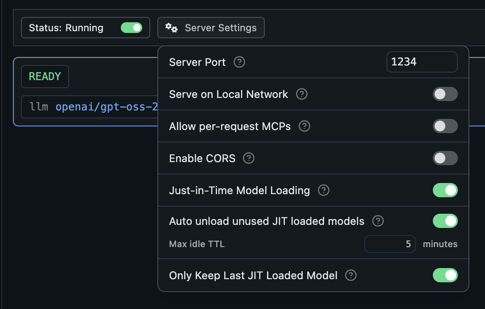
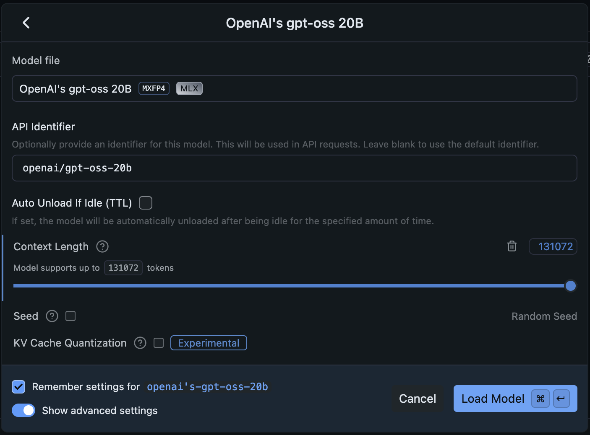
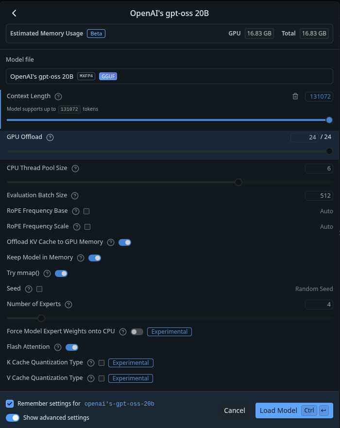

# Customizing Your AI

LIMA uses a local LLM to extract insights from transcripts. This guide covers how to choose, configure, and optimize your AI backend.

## Choosing an LLM Backend

| Feature | llama-swap + llama.cpp | LM Studio | Ollama | Cloud (OpenAI, etc.) |
|---------|------------------------|-----------|--------|----------------------|
| **Setup** | Two binaries + one YAML | GUI app, download models visually | CLI, `ollama pull` | API key only |
| **Ease of use** | Developer-friendly | Beginner-friendly | Developer-friendly | Easiest |
| **Privacy** | 100% local | 100% local | 100% local | Data leaves your machine |
| **Cost** | Free (MIT) | Free (closed core) | Free (MIT) | Per-token pricing |
| **Tool calling** | Excellent ([measured](benchmarks.md)) | Good (with compatible models) | Good, but fragile in agent loops with *thinking* models ([measured](benchmarks.md)) | Excellent |
| **VRAM when idle** | Zero (per-model TTL → process exit) | Near-zero (JIT + auto-evict) | Zero (`keep_alive` expiry) | n/a |
| **Best for** | NVIDIA Linux, agent workflows, shared/gaming GPUs | Visual setup, macOS, experimentation | Quick starts, model tasting | Convenience |

**Recommendation:** On NVIDIA/Linux, use **llama-swap + llama.cpp** — in side-by-side testing of LIMA's own workflows it was the only backend with zero tool-calling misbehavior, and its cold starts and idle-to-zero VRAM are excellent (see [Benchmarks](benchmarks.md)). LM Studio remains the friendliest path on macOS or if you want a GUI. Ollama works, with caveats for agent workflows (below). Use cloud only if local inference is too slow on your hardware.

---

## llama-swap + llama.cpp Setup (recommended on NVIDIA/Linux)

[llama-swap](https://github.com/mostlygeek/llama-swap) is a small MIT-licensed proxy
that spawns a [llama.cpp](https://github.com/ggml-org/llama.cpp) `llama-server`
per model on demand, routes OpenAI-compatible requests by the request's `model`
field, and kills the process after an idle TTL — VRAM genuinely returns to zero.
One endpoint, many models, nothing resident when idle.

### 1. Install

- **Arch:** `yay -S llama.cpp-cuda llama-swap-bin` (llama.cpp compiles from source, expect ~10 min)
- **Other:** [llama.cpp releases](https://github.com/ggml-org/llama.cpp/releases) + [llama-swap releases](https://github.com/mostlygeek/llama-swap/releases) (single Go binary), or llama-swap's CUDA Docker image

### 2. Download a model (GGUF)

```bash
export HF_XET_HIGH_PERFORMANCE=1   # parallel chunked downloads — saturates fast lines
uvx --from 'huggingface_hub[cli]' hf download \
  unsloth/Qwen3-Coder-30B-A3B-Instruct-GGUF Qwen3-Coder-30B-A3B-Instruct-Q4_K_M.gguf \
  --local-dir ~/.cache/llama.cpp
```

Model guidance (measured in [Benchmarks](benchmarks.md)): `Qwen3-Coder-30B-A3B`
Q4_K_M (~18.6GB file, 20.3GB VRAM @ 16K context) is an excellent agent model for
24GB cards; `Qwen3-8B` Q4_K_M (~5GB) for smaller cards or faster responses.
**Avoid *thinking* models for tool-loop workflows**, and avoid `gpt-oss-20b`
(documented tool-calling problems on every backend).

### 3. Configure (`~/.config/llama-swap/config.yaml`)

```yaml
healthCheckTimeout: 300

models:
  "qwen3-coder-30b":
    cmd: |
      llama-server --port ${PORT}
      -m /home/YOU/.cache/llama.cpp/Qwen3-Coder-30B-A3B-Instruct-Q4_K_M.gguf
      --jinja -ngl 99 -c 16384
    ttl: 300
```

`--jinja` enables the model's own chat template (required for reliable tool
calling); `ttl: 300` unloads after 5 idle minutes. Add one block per model —
requests pick the model by name, llama-swap swaps processes automatically.

### 4. Run

```bash
llama-swap -config ~/.config/llama-swap/config.yaml -listen :9292 -watch-config
```

The dashboard at `http://localhost:9292` shows loaded models and logs.
`POST /api/models/unload` force-unloads instantly (handy before gaming).
If n8n runs in Docker and the server on the host, allow the Docker subnets
through your firewall and use the host's LAN IP in the credential (same pattern
as [native whisper](native-whisper.md)).

### 5. n8n Credential Setup

1. In n8n: **Settings → Credentials → Add → OpenAI API**
2. Configure:
   - **Name:** `llama-swap local`
   - **API Key:** `local` (any non-empty string)
   - **Base URL:** `http://host.docker.internal:9292/v1` (Linux: your host LAN IP)

Set `LOCAL_LLM_PORT=9292` and `LLM_MODEL=qwen3-coder-30b` in `.env` before
`make seed` to get this wired automatically.

---

## LM Studio Setup

### 1. Download a Model

In LM Studio's **Discover** tab, search for and download a model. Recommended options:

| Model | Size | Notes |
|-------|------|-------|
| `Qwen2.5-7B-Instruct` | ~5GB | Good balance of speed and quality |
| `gpt-oss-20b` | ~12GB | Higher quality, needs more VRAM |
| `Llama-3.2-3B-Instruct` | ~2GB | Fast, good for testing |

### 2. Configure LM Studio Server Settings

In the **Developer** tab, enable these settings for reliable n8n integration:

| Setting | Value | Why |
|---------|-------|-----|
| Just-in-Time Model Loading | ON | Loads model on first request (no manual loading) |
| Auto unload unused JIT loaded models | ON | Frees memory when idle |
| Max idle TTL | 5 minutes | Balance between responsiveness and memory |
| Only Keep Last JIT Loaded Model | ON | Prevents memory issues with multiple models |



### 3. Configure Model Settings

Click the **gear icon** next to your loaded model in **My Models** to access per-model settings:

| Setting | Recommendation | Notes |
|---------|----------------|-------|
| Context Length | 8192+ | Start at 8K for testing, increase as system allows for production |
| Flash Attention | ON | Reduces memory, improves speed |
| GPU Offload | Max layers | Keep as many layers on GPU as VRAM allows |
| KV Cache Quantization | OFF (if system allows) | Reduces memory, improves speed, but may degrade quality. |

Settings on MacBook Pro M4 (24GB RAM):


Settings on Linux (RTX 4090 24GB VRAM):


### 4. Start the Server

Go to **Developer → Start Server**. LM Studio runs on `http://localhost:1234`.

### 5. n8n Credential Setup

If you used `make seed`, the credential is already configured. To create manually:

1. In n8n: **Settings → Credentials → Add → OpenAI API**
2. Configure:
   - **Name:** `LM Studio Local`
   - **API Key:** `lm-studio` (any non-empty string works)
   - **Base URL:** `http://host.docker.internal:1234/v1`

> **Linux users:** Replace `host.docker.internal` with your machine's IP address.

<details>
<summary><b>Known Issue: Harmony 0.3.5 + gpt-oss-20b</b></summary>

Tool calling fails for `gpt-oss-20b` with "Unexpected end of content" parsing errors on some platforms.

| Platform | Harmony 0.3.4 | Harmony 0.3.5 |
|----------|---------------|---------------|
| macOS    | Works | Works |
| Linux    | Works | Fails |
| Windows  | Works | Fails |

**Symptoms:**
- Model generates valid JSON but LM Studio's Harmony formatter fails to parse
- Returns empty `tool_calls: []` and `content: ""`
- n8n throws "Unexpected end of JSON input"

**Workaround** If LM Studio has it cached from previous download, uninstall 0.3.5 to use 0.3.4 in LM Studio Runtime settings.

**Recommended alternative:** Ollama with the same model could work better, but requires more configuration of context windows, KV-cache, etc.: `ollama run gpt-oss:20b`

</details>

---

## Ollama Setup

> **Agent-workflow caveats (measured, 2026-07 — see [Benchmarks](benchmarks.md)):**
> with *thinking* models (e.g. `qwen3:8b`), Ollama's chat template caused
> speculative/hallucinated tool calls in every multi-tool trial that the same
> weights ran cleanly on llama.cpp; `/no_think` is ignored on the OpenAI-compat
> route, roughly doubling agent-chain latency. Non-thinking models
> (`qwen3-coder:30b`) worked fine. Two setup gotchas: the default context is
> small and truncates silently (set `OLLAMA_CONTEXT_LENGTH=16384` via a systemd
> override), and Ollama binds `127.0.0.1` by default — set
> `OLLAMA_HOST=0.0.0.0:11434` so the n8n container can reach it.

### 1. Install Ollama

```bash
# Linux/macOS
curl -fsSL https://ollama.com/install.sh | sh

# Windows: Download from https://ollama.ai/
```

### 2. Pull a Model

```bash
ollama pull llama3.2
# Or for higher quality:
ollama pull qwen2.5:7b
```

Ollama runs automatically on `http://localhost:11434`.

### 3. Configure Environment

Before running `make seed`, set the Ollama port:

```bash
echo "LOCAL_LLM_PORT=11434" >> .env
source .env
make seed
```

### 4. n8n Credential Setup

If you used `make seed` with `LOCAL_LLM_PORT=11434`, the credential is configured. To create manually:

1. In n8n: **Settings → Credentials → Add → OpenAI API**
2. Configure:
   - **Name:** `Ollama Local`
   - **API Key:** `ollama` (any non-empty string)
   - **Base URL:** `http://host.docker.internal:11434/v1`

---

## Context Windows Explained

The context window determines how much text the model can process at once. Larger contexts handle longer transcripts but use more memory.

### What Happens When Context Is Exceeded?

- The model truncates input (loses earlier content)
- Or fails with an error
- Either way, you lose information

**Solution for long recordings:** Chunk audio before transcription. See [Audio Processing Guide](audio-processing-guide.md).

### Performance Implications

- **GPU memory full → CPU fallback:** 80-90% performance loss
- **Flash Attention enabled:** Reduces memory usage, enables longer contexts
- **Smaller models:** Can run larger contexts on the same hardware

**For detailed context window benchmarks** (8K-128K tokens across multiple models on NVIDIA hardware), see: [Americas AI - Ollama Context Benchmarks](https://github.com/leoric-crown/n8n_pgvector16/tree/main/ollama)

---

## Environment Variables Reference

### Required

| Variable | Purpose | How to generate |
|----------|---------|-----------------|
| `POSTGRES_PASSWORD` | Database password | `openssl rand -base64 32` |
| `N8N_DB_PASSWORD` | n8n database password | `openssl rand -base64 32` |
| `N8N_ENCRYPTION_KEY` | Encrypts n8n credentials | `openssl rand -hex 32` |
| `MCP_AUTH_TOKEN` | MCP server authentication | `openssl rand -hex 32` |

### Optional

| Variable | Default | Purpose |
|----------|---------|---------|
| `N8N_API_KEY` | - | Enable workflow seeding and MCP |
| `N8N_PORT` | 5678 | External port for n8n |
| `LOCAL_LLM_PORT` | 1234 | LLM server port (llama-swap example: 9292; Ollama: 11434; LM Studio: 1234) |
| `LLM_MODEL` | `openai/gpt-oss-20b` | Model name for workflows (must support tool calling; `qwen3-coder-30b`-class recommended — see [Benchmarks](benchmarks.md)) |
| `WHISPER_MODEL` | `Systran/faster-whisper-base` | Whisper model size |
| `NATIVE_WHISPER_PORT` | 9001 | Port for native CUDA/MLX whisper |

---

## Customizing the Prompt

The insight extraction prompt determines what LIMA extracts from your transcripts.

### Where to Find It

1. Open n8n: http://localhost:5678
2. Open the **Voice Memo Processor** workflow
3. Find the **AI Agent** or **OpenAI** node
4. Click to edit the prompt

### What You Can Change

The default prompt extracts:
- Title
- Summary
- Key points
- Action items

**Ideas to try:**
- Add custom fields: "Budget items", "Decisions made", "Questions raised"
- Change the tone: formal report vs casual notes
- Focus on specific domains: technical details, customer feedback, project updates

---

## Try This

> **Experiment with models:** Process the same recording with a small model (Llama 3.2 3B) and a larger one (Qwen 2.5 7B). Compare the quality of extracted insights.

> **Customize extraction:** Edit the prompt to extract "Risks and concerns" as a new section. Record a memo about a project challenge and see how it handles it.

> **Test context limits:** Record a 30-minute memo. Does it process fully? Try adjusting context window size and observe the difference.

---

## Next Steps

- [Recipes](recipes.md) - Practical use cases for different memo types
- [Troubleshooting](troubleshooting.md) - LLM-specific issues and fixes
