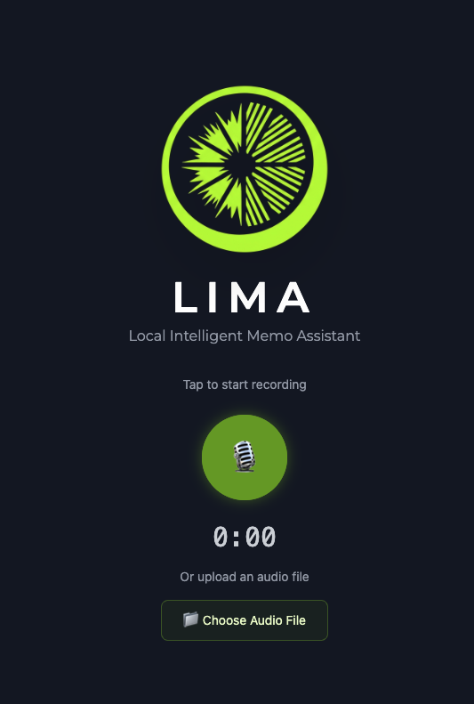
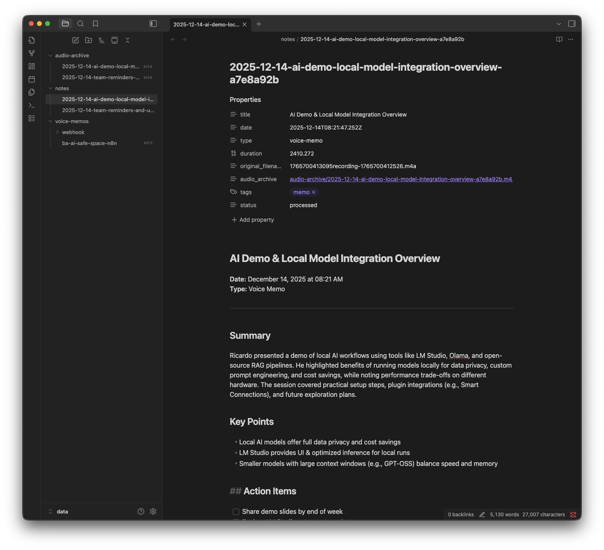

# Getting Started with LIMA

This guide walks you through setting up LIMA and processing your first voice memo. Expect about 15 minutes for initial setup.

## Prerequisites

### System Requirements

| Component | Minimum | Recommended |
|-----------|---------|-------------|
| **RAM** | 8GB | 16GB+ |
| **Disk** | 10GB free | 20GB+ (models can be large) |
| **GPU VRAM** | Not required | 6GB+ for faster LLM inference |

> **First run downloads:** Docker images (~2GB), Whisper model (~150MB), and your chosen LLM (2-12GB depending on model).

### Software

Before starting, install:

- **Docker** - Runs LIMA's services
  - [Docker Desktop](https://docker.com) - easiest option, works on all platforms

  > **Corporate laptops:** Docker Desktop requires a [paid subscription](https://www.docker.com/pricing/) for organizations with 250+ employees or $10M+ revenue. Free alternatives:
  > - **Linux:** [Docker Engine](https://docs.docker.com/engine/install/)
  > - **Windows:** [Docker Engine in WSL2](https://dev.to/bowmanjd/install-docker-on-windows-wsl-without-docker-desktop-34m9) (use `wsl docker ...` from PowerShell)
  > - **macOS:** [Colima](https://github.com/abiosoft/colima) or [Podman](https://podman.io/)
- **Local LLM** - One of:
  - [LM Studio](https://lmstudio.ai/) (recommended) - GUI app, beginner-friendly
  - [Ollama](https://ollama.ai/) - CLI-based, simpler setup
- **make** (for running setup/management commands):
  - macOS: `xcode-select --install`
  - Linux (Debian/Ubuntu): `sudo apt install make`
  - Linux (Fedora): `sudo dnf install make`
  - Windows: [Chocolatey](https://chocolatey.org/): `choco install make`
- **uv** (Python package manager for LIMA's scripts):
  - [Installation instructions](https://docs.astral.sh/uv/getting-started/installation/)

> **Cloud LLMs:** You *can* use OpenAI, Anthropic, or other cloud providers, but LIMA is designed for local-first privacy. See [Customizing Your AI](customizing-your-ai.md) for cloud setup.

---

## 1. Clone and Configure

```bash
git clone https://github.com/leoric-crown/lima.git
cd lima
cp .env.example .env
```

Edit `.env` and set secure passwords (generate with the commands shown):

```bash
# Required - generate secure values:
POSTGRES_PASSWORD=<run: openssl rand -base64 32>
N8N_DB_PASSWORD=<run: openssl rand -base64 32>
N8N_ENCRYPTION_KEY=<run: openssl rand -hex 32>
MCP_AUTH_TOKEN=<run: openssl rand -hex 32>
```

---

## 2. Start Services

```bash
make up
```

This starts three services:
- **postgres** - Database for storing workflow data
- **n8n** - Visual workflow automation (with ffmpeg for audio processing)
- **whisper** - Speech-to-text transcription

First run builds a custom n8n image (~2-3 minutes).

> **Check status anytime:** `make status`

---

## 3. Understanding the Two Ports

LIMA exposes two ports. Here's why:

| Port | Service | What it's for |
|------|---------|---------------|
| 5678 | n8n | Workflow editor, API, webhooks |
| 8888 | Caddy | Voice Recorder UI + reverse proxy to n8n |

**Why Caddy?**

The Voice Recorder (`/lima/recorder/`) needs a web server - browsers block microphone access when opening HTML files directly from disk. Caddy serves the static UI and proxies everything else to n8n.

**Which port should I use?**
- **Local development:** Either works. Use `localhost:5678` for n8n directly, `localhost:8888/lima/recorder/` for the Voice Recorder.
- **Remote access:** Use port 8888 through Tailscale (see [Using LIMA on Your Phone](using-lima-on-your-phone.md)).

> **Advanced:** Caddy can also handle TLS/HTTPS if you want to expose LIMA on a custom domain without Tailscale. See [Caddy's automatic HTTPS docs](https://caddyserver.com/docs/automatic-https).

---

## 4. Set Up n8n

Open http://localhost:5678 and create your admin account.

### Unlock Free Features

n8n offers free lifetime features for self-hosted users:

1. Go to **Settings → Usage and plan**
2. Click **"Unlock selected paid features for free"**
3. Enter your email
4. Check your inbox for the license email
5. Click the activation link (or paste the license key)

You should see "You're on the Community Edition" when successful.

**Direct link:** http://localhost:5678/settings/usage

### Generate an API Key

The API key enables workflow seeding and AI-assisted development:

1. Go to **Settings → API → Create API Key**
2. Copy the key
3. Add it to your `.env` as `N8N_API_KEY`

> **Tip:** `make setup` handles API key capture automatically during the interactive wizard.

**Direct link:** http://localhost:5678/settings/api

---

## 5. Import the Voice Memo Workflows

LIMA includes a seed command that imports pre-built workflows:

```bash
make seed
```

This imports from `workflows/seed/`:
- **Voice Memo Processor (Speaches)** - Uses Docker Whisper (recommended for most users)
- **Voice Memo Processor (CUDA/MLX)** - Uses native GPU whisper (see [Native Whisper](native-whisper.md))
- **LM Studio Local** credential (pre-configured)

> **Safe to run multiple times** - `make seed` checks for duplicates by workflow name and prompts before overwriting. If you rename a workflow, it won't be affected by future seed runs.

**Platform notes:**
- **macOS/Windows:** Works out of the box
- **Linux:** `make seed` auto-replaces `host.docker.internal` with your machine's IP
- **Ollama users:** Set `LOCAL_LLM_PORT=11434` in `.env` before seeding

<details>
<summary><b>Manual import (if seed fails)</b></summary>

1. Browse `workflows/seed/` and open the Speaches workflow JSON in a text editor
2. Copy the entire JSON
3. In n8n, create a new workflow and press `Ctrl+V` / `Cmd+V`
4. Create credential manually: **Settings → Credentials → Add → OpenAI API**
   - Name: `LM Studio Local`
   - API Key: `lm-studio`
   - Base URL: `http://host.docker.internal:1234/v1`
</details>

---

## 6. Activate the Workflow

Imported workflows are **inactive** by default:

1. Open http://localhost:5678/home/workflows
2. Click on **Voice Memo Processor (Speaches)** (or the CUDA/MLX version if using native whisper)
3. Toggle **Inactive → Active** in the top right

The workflow now listens for:
- Files dropped in `data/voice-memos/`
- Webhook requests at `http://localhost:5678/webhook/memo`

> **Which workflow?** Use the **Speaches** version unless you've set up native GPU whisper. See [Native Whisper](native-whisper.md) for details.

---

## 7. Start Your Local LLM

Before recording, ensure your LLM is running:

**LM Studio:**
1. Open LM Studio
2. Download a model if you haven't (e.g., `Qwen2.5-7B-Instruct`)
3. Go to **Developer → Start Server**

**Ollama:**
```bash
ollama pull llama3.2
# Ollama runs automatically on http://localhost:11434
```

See [Customizing Your AI](customizing-your-ai.md) for recommended settings.

---

## 8. Your First Recording

Open the Voice Recorder: http://localhost:8888/lima/recorder/



1. Click the **microphone button** to start recording
2. Speak your memo (try: "This is a test memo about setting up LIMA")
3. Click again to **stop and upload**
4. Watch the processing status

---

## 9. Check the Output

After processing completes (~30 seconds to 2 minutes depending on length and hardware):

```bash
ls -la data/notes/
cat data/notes/2025-*.md
```

You should see a markdown file with:
- YAML frontmatter (date, tags, source file)
- Title extracted from content
- Summary
- Key points
- Action items (if any)



> **Tip:** Open `data/` in [Obsidian](https://obsidian.md/) to browse your notes with wikilinks and graph view.

---

## You're All Set!

> **Safe to tinker:** If you break a workflow, rename it (to keep your work) or delete it, then run `make seed` to reimport the defaults. Experiment freely!

> **Watch it work:** Open n8n at http://localhost:5678 while a recording processes to see data flow through each step in real-time.

---

## Next Steps

- [Customizing Your AI](customizing-your-ai.md) - Optimize your LLM settings
- [Recipes](recipes.md) - Practical use cases
- [Where Is My Data?](where-is-my-data.md) - File locations and Obsidian setup

## Common Issues

If something didn't work, check [Troubleshooting](troubleshooting.md) or run:

```bash
make status          # Check service health
docker compose logs  # View recent logs
```
