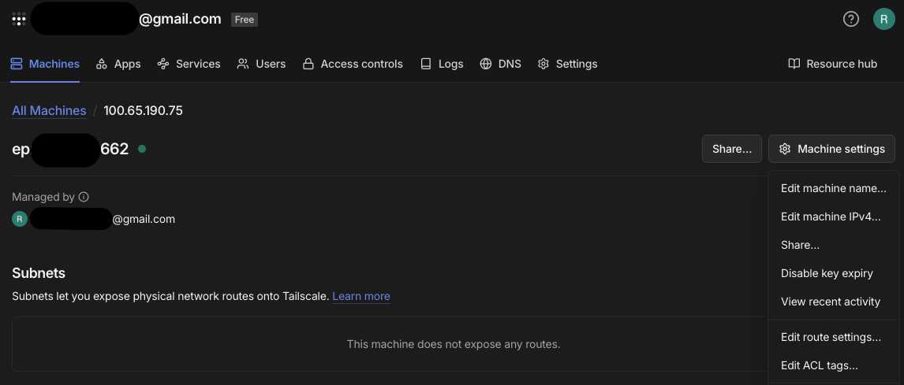

# Using LIMA on Your Phone

Access LIMA from anywhere using Tailscale - record voice memos from your phone and have them processed by your home server.

## Why Tailscale?

Tailscale creates a private network between your devices without exposing ports to the internet.

- **No port forwarding** - Works through NAT and firewalls automatically
- **No dynamic DNS** - Stable hostname for your machine
- **Encrypted** - WireGuard encryption built-in
- **Private** - Only your devices can access your tailnet
- **Free tier** - 100 devices, 3 users - plenty for personal use

---

## Setup Overview

1. Install Tailscale on your LIMA server
2. Install Tailscale on your phone
3. Serve the Voice Recorder with HTTPS
4. (Optional) Make it persistent across reboots

---

## 1. Install Tailscale on Your Server

```bash
# Linux (Fedora/Ubuntu/Debian)
curl -fsSL https://tailscale.com/install.sh | sh

# macOS
brew install tailscale

# Start and authenticate
sudo tailscale up --operator=$USER
```

Follow the browser link to authenticate with your Tailscale account.

---

## 2. Install on Your Phone

- **iOS:** App Store → "Tailscale"
- **Android:** Play Store → "Tailscale"

Sign in with the same account you used on your server.

### Verify Connection

```bash
tailscale status
# Shows all devices on your tailnet with their IPs and hostnames
```

---

## 3. Serve the Voice Recorder with HTTPS

Browsers require HTTPS for microphone access (except localhost). Use Tailscale to serve the Voice Recorder securely:

```bash
tailscale serve --bg --https 443 http://localhost:8888
```

The Voice Recorder is now accessible at:
```
https://<your-machine-name>.<tailnet-name>.ts.net/lima/recorder/
```

### Certificate Warning

On first access, your phone browser may show a "Certificate Transparency" warning. This is expected with Tailscale's tailnet-only certificates.

**To bypass:**
- **Android Chrome:** Tap "Advanced" → "Proceed to... (unsafe)"
- **iOS Safari:** Tap "Show Details" → "visit this website"

**Why this is safe:**
- Tailscale encrypts all traffic with WireGuard end-to-end
- The certificate is valid, just not CT-logged (Tailscale limitation)
- Only devices on your tailnet can access this URL

---

## 4. Access LIMA Remotely

Once configured, access these URLs from any device on your tailnet:

| Service | URL |
|---------|-----|
| Voice Recorder | `https://<hostname>.ts.net/lima/recorder/` |
| n8n UI | `https://<hostname>.ts.net/` |
| Webhook | `https://<hostname>.ts.net/webhook/memo` |

All traffic flows through: `HTTPS (Tailscale TLS) → Caddy (HTTP:8888) → n8n`

---

## 5. Making It Persistent (Auto-Start on Boot)

On boot, `tailscaled` may start before the network is ready. We use two mechanisms to handle this:

### Step 1: NetworkManager Dispatcher

This runs `tailscale up` when network connectivity is established:

```bash
sudo tee /etc/NetworkManager/dispatcher.d/99-tailscale <<'EOF'
#!/bin/bash
# Connect tailscale when network connectivity is established

if [ "$2" = "connectivity-change" ] && [ "$CONNECTIVITY_STATE" = "FULL" ]; then
    # Only if tailscale is disconnected
    if ! tailscale status >/dev/null 2>&1; then
        logger -t tailscale-dispatcher "Network up, connecting tailscale..."
        tailscale up
    fi
fi
EOF

sudo chmod +x /etc/NetworkManager/dispatcher.d/99-tailscale
```

### Step 2: Systemd Service

This configures `tailscale serve` on boot, retrying until tailscale is connected:

```bash
sudo tee /etc/systemd/system/tailscale-serve-lima.service > /dev/null <<EOF
[Unit]
Description=Tailscale Serve for LIMA Voice Recorder
After=network-online.target tailscaled.service
Wants=network-online.target
Requires=tailscaled.service

[Service]
Type=oneshot
RemainAfterExit=yes
ExecStart=/usr/bin/tailscale serve --bg --https 443 http://localhost:8888
ExecStop=/usr/bin/tailscale serve --https=443 off
User=root
# Retry if tailscale not ready yet
Restart=on-failure
RestartSec=5
StartLimitBurst=10

[Install]
WantedBy=multi-user.target
EOF
```

### Step 3: Enable and Start

```bash
sudo systemctl daemon-reload
sudo systemctl enable tailscale-serve-lima.service
sudo systemctl start tailscale-serve-lima.service
```

**How it works on boot:**
1. `tailscaled` starts (may be in NoState if network isn't ready)
2. NetworkManager detects full connectivity → dispatcher runs `tailscale up`
3. `tailscale-serve-lima` retries every 5s until tailscale connects, then configures serve

---

## Managing Key Expiry

Tailscale machine keys expire after **180 days** by default.

### Check Your Key Expiry

```bash
tailscale status --json | grep KeyExpiry | head -1
```

### What Happens When It Expires

- Tailscale can't connect to your tailnet
- The serve service fails
- **Fix:** Re-authenticate with `tailscale up`

### Disable Expiry (Recommended for Personal Devices)

1. Visit https://login.tailscale.com/admin/machines
2. Find your machine in the list
3. Click **⋯** menu → **Disable key expiry**
4. Confirm



This makes authentication permanent - ideal for personal servers you control.

---

## Manual Mode

If you prefer not to use systemd, just re-run the command after reboots:

```bash
# Start serve
tailscale serve --bg --https 443 http://localhost:8888

# Stop serve
tailscale serve reset                    # Remove all serve configs
# or
tailscale serve --https=443 off          # Stop specific port
```

---

## Mobile Integration Ideas

Once Tailscale is working, you can integrate LIMA with mobile automation:

### iOS Shortcuts

Create a Shortcut to send voice memos:
1. **Record Audio** action
2. **Get Contents of URL** action (POST to webhook)
3. **Show Notification** with result

See [Apple's Shortcuts documentation](https://support.apple.com/guide/shortcuts/welcome/ios) for details.

### Android Automation

Use Tasker, Automate, or MacroDroid to:
1. Record audio
2. Upload via HTTP POST to the webhook
3. Display notification

### Progressive Web App

The Voice Recorder works as a PWA - add it to your home screen for app-like access.

---

## Troubleshooting

### Check Tailscale Status

```bash
# Network and connected devices
tailscale status

# Current serve configuration
tailscale serve status

# Daemon status
systemctl status tailscaled.service

# Serve service status (if using systemd)
systemctl status tailscale-serve-lima.service

# Check if dispatcher ran on boot
journalctl -b 0 | grep tailscale-dispatcher

# Test connectivity from phone
tailscale ping <your-phone-hostname>
```

### Expected `serve status` Output

```
https://<your-machine>.tail63f25b.ts.net (tailnet only)
|-- / proxy http://localhost:8888
```

### Common Issues

**"Connection refused" on phone:**
- Is tailscale running? `tailscale status`
- Is serve configured? `tailscale serve status`
- Are both devices on the same tailnet?

**"Certificate error" (not just CT warning):**
- Run `tailscale serve status` to verify configuration
- Try `tailscale serve reset` and reconfigure

**Serve not persisting after reboot:**
- Check systemd service: `systemctl status tailscale-serve-lima`
- Check dispatcher logs: `journalctl -b 0 | grep tailscale-dispatcher`

---

## Corporate Mac Workaround (CLI-Only)

Corporate-managed Macs often block the Tailscale GUI app from creating VPN configurations. Use the CLI approach:

### 1. Install via Homebrew

```bash
brew install tailscale
```

### 2. Start the Daemon

```bash
# Start tailscaled via brew services (persists across reboots)
sudo brew services start tailscale

# Authenticate (first time only)
sudo tailscale up
```

### 3. Fix MagicDNS

The Homebrew version doesn't automatically configure `.ts.net` domain resolution:

```bash
sudo bash -c 'echo "nameserver 100.100.100.100" > /etc/resolver/ts.net'
```

### 4. Verify

```bash
# Check tailnet devices
tailscale status

# Test DNS resolution
dig +short <your-lima-server>.tail63f25b.ts.net

# Test HTTPS access
curl https://<your-lima-server>.tail63f25b.ts.net/lima/recorder/
```

**Why this works:** The CLI daemon creates a userspace tunnel directly, bypassing VPN entitlements that MDM may block.

---

## Next Steps

- [Where Is My Data?](where-is-my-data.md) - Set up Obsidian sync for remote access to notes
- [Troubleshooting](troubleshooting.md) - More help with connectivity issues
