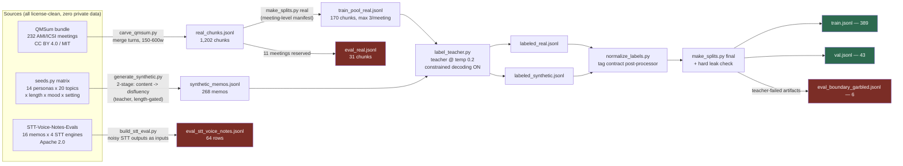
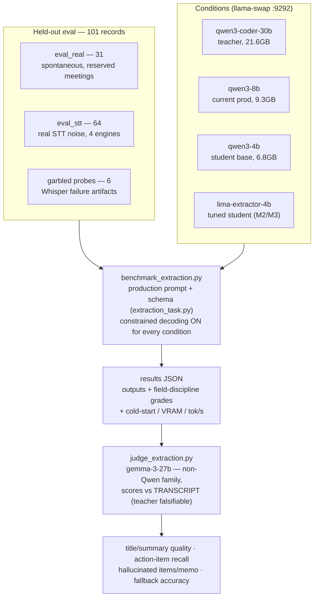
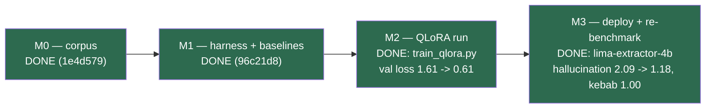

# LIMA extraction distillation — corpus & pipeline

Distills LIMA's structured-extraction task (voice memo transcript → 6-field
JSON note) from the production teacher model (`qwen3-coder-30b`) into a small
student, with an eval harness measuring retained content quality. The task
definition — system message, user template, JSON Schema — is imported verbatim
from the live n8n workflow via `extraction_task.py`, the single source of
truth for every pipeline stage.

## Pipeline map



Green = training surface. Red = held-out eval, never trained on.

## Corpus recipe (built 2026-07-04/05)

**Train 389 / val 43 pairs**, split by transcript/meeting (real) and by cell
id (synthetic), never by row. Assembled by `make_splits.py`; the manifest
(`corpus/split_manifest.json`) reserves whole AMI/ICSI meetings for eval and
`make_splits.py final` hard-fails if a labeled train row comes from one.

- **~60% synthetic** — two-stage teacher generation: fluent first-person memo
  from a persona × topic × length × mood × setting seed matrix (temp 0.9),
  then a disfluency-injection rewrite (temp 0.7) with a hard length gate.
  `seeds.py` + `generate_synthetic.py`.
- **~40% real spontaneous speech** — monologue-ish chunks carved from AMI and
  ICSI meeting transcripts (via the QMSum bundle): same-speaker turns merged
  across ≤1 short backchannel, 150–600 words, real disfluencies preserved,
  markup stripped. Parliamentary "Committee" transcripts excluded (prepared
  speech, wrong register). `carve_qmsum.py`.
- **Labels** — teacher runs the exact production task at temp 0.2 with
  llama.cpp schema-constrained decoding ON (the same condition every eval
  uses). `label_teacher.py`. Records carry `gen_version`/`label_version`;
  resume skips only rows produced by current code.
- **Label normalization** — `normalize_labels.py` applies the tag contract
  (lowercase kebab, 2–5 tags) the schema *describes* but constrained decoding
  cannot enforce; the teacher violates it in ~9% of raw labels. Deterministic
  post-processor, raw labels preserved alongside.

## Eval slices (`corpus/eval/` + `corpus/eval_real.jsonl`) — never trained on

- `eval_real.jsonl` — 31 chunks from 11 reserved AMI/ICSI meetings: genuinely
  spontaneous, disfluent held-out speech.
- `eval/eval_stt_voice_notes.jsonl` — 64 rows: 16 scripted voice-memo readings
  × 4 real STT systems' raw outputs (STT-Voice-Notes-Evals). The memos are
  scripted, not spontaneous — so the noisy STT outputs are the eval inputs and
  the clean scripts ride along as judge reference.
- `eval/eval_boundary_garbled.jsonl` — 6 STT-failure-artifact probes
  (verbatim loops, polite-phrase hallucinations, contentless prose). Routed
  here because the teacher itself fails them: it converts "Thanks for
  watching!" spam into a structured note instead of the fallback. Known
  teacher weakness, kept as an eval dimension.

## Measurement architecture (harness lives in `../scripts/`)



## Measured baselines (M1.1, 2026-07-05)

Full data: `../scripts/benchmark_results/extraction_judged_20260705_044004.json`
(single controlled benchmark pass; two-phase judge — expected action items
extracted blind per transcript into `judge_reference.json`, then each output
graded against that fixed reference. The original M1 judge computed "expected"
while reading each model's output, which anchored the denominator per model;
those numbers were retired after peer review.)

| judge scores (blind reference) | 30B teacher | 8B (prod) | 4B student |
|---|---|---|---|
| title / summary quality (1–5) | 4.83 / 4.74 | 4.84 / 4.80 | 4.91 / 4.91 |
| action-item recall | 0.94 | 0.94 | 0.98 |
| **hallucinated items / memo** | **0.78** | 1.21 | **2.11** |
| tags kebab-case (code grade, non-fallback rows) | 0.96 | 0.50 | 0.22 |
| VRAM net / cold start / post-warm median | 19.6GB / 5.4s / 1.1s | 7.3GB / 5.4s / 4.5s | 5.2GB / 1.7s / 1.8s |

How to read this honestly:

- **The judge's 1–5 quality rubric saturates** (the STT slice scores 5/5 for
  every model on nearly every row) — it does not discriminate at this
  granularity and is reported for completeness, not as a claim.
- **Recall is not the gap either** — the 4B actually captures the *most*
  reference action items (0.98) because it over-extracts.
- **The discriminating metric is grounding**: hallucinated items/memo runs
  0.78 → 1.21 → 2.11, a monotonic ~2.7x gap. The 4B's profile is
  "highest coverage, most fabrication" — so M2 tunes for **precision and
  format discipline**, not coverage or fluency.
- The garbled slice (n=6 ambiguous boundary probes) is reported as
  *appropriateness*, not "fallback accuracy": the teacher emits zero literal
  fallbacks on it, and the judge's appropriateness call is unstable across
  runs on these deliberately ambiguous inputs. No headline claim rests on it.
- The STT slice is **16 memos × 4 STT systems** — aggregated per memo
  (n_clusters=16), not as 64 independent rows.
- The 2–3-sentence summary contract is failed by *every* model **including
  the teacher** (0.14–0.53) — a prompt-vs-behavior gap in production itself,
  left visible rather than patched.
- VRAM is net (loaded minus idle desktop); latency is post-warm median —
  cold start is reported separately. The 30B MoE is the *fastest* per memo;
  the axis being right-sized is VRAM residency, not speed.

## M2 — QLoRA training (2026-07-05)

`train_qlora.py`: Qwen/Qwen3-4B-Instruct-2507, NF4 double-quant base
(bitsandbytes), LoRA r=16 alpha=32 on q_proj/v_proj (5.9M trainable, 0.15%),
completion-only loss (prompt tokens masked), lr 2e-4 cosine, effective batch
16, 3 epochs = 75 steps, ~9 min on the RTX 4090. One run, no sweep. Val loss
1.61 → 0.61, flattening by epoch 3 (0.648 / 0.616 / 0.612).

Prompts are the production task from `extraction_task.py` rendered with the
model's own chat template; targets are the normalized teacher labels as
compact JSON + `<|im_end|>`. Each example is asserted token-for-token against
the template's full-conversation render, and `verify_template.py` confirmed
the HF training template matches what llama.cpp `--jinja` serves from the
GGUF (exact string match on the production message shape) — checked on both
the base and the tuned GGUF.

Training env: uv project in this directory (`pyproject.toml`, Python pinned
3.13 for torch/bitsandbytes wheels). Artifacts land in `runs/` (gitignored):
adapter, merged bf16 checkpoint, `run_meta.json` with the full log history.

## M3 — deployed comparison (2026-07-05)

Deploy path: `merge_adapter.py` (bf16 merge — never merge into 4-bit) →
`convert_hf_to_gguf.py` f16 → `llama-quantize` Q4_K_M →
`~/.cache/llama.cpp/lima-extractor-4b-Q4_K_M.gguf` → llama-swap route
`lima-extractor-4b`. Both conditions below are the *deployed quantized*
artifacts measured in one controlled pass (same harness, judge, and cached
blind reference as M1.1). Full data:
`../scripts/benchmark_results/extraction_judged_20260705_134640.json`.

| deployed Q4_K_M, same pass | qwen3-4b (base) | lima-extractor-4b (tuned) | teacher ref (M1.1) |
|---|---|---|---|
| **hallucinated items / memo (all rows)** | 2.09 | **1.18** | 0.78 |
| — real slice / stt slice (n=16 clusters) | 1.87 / 2.22 | 1.52 / 1.02 | — |
| action-item recall | 0.99 | 0.97 | 0.94 |
| tags kebab-case (code grade) | 0.18 | **1.00** | 0.96 |
| tags 2–5 count | 0.57 | 0.93 | — |
| title / summary quality (1–5, saturated) | 4.92 / 4.92 | 4.82 / 4.82 | 4.83 / 4.74 |
| VRAM net / cold start / post-warm median | 5.2GB / 2.7s / 2.0s | 5.2GB / 1.6s / **1.0s** | 19.6GB / 5.4s / 1.1s |

How to read this honestly:

- **The tune did what it was aimed at**: hallucinated items/memo drops 44%
  (2.09 → 1.18), landing at the 8B prod model's level (1.21 in M1.1) in a
  5.2GB footprint; tag format discipline goes from worst-in-family (0.18) to
  perfect (1.00). Post-warm latency halves because outputs got teacher-concise.
- **The cost is a small recall dip** — 0.99 → 0.97 overall, and 0.98 → 0.93
  on the real (spontaneous speech) slice. That is the intended precision/
  coverage trade, but it is a real trade, not a free win.
- **Still not teacher-grade grounding**: 1.18 vs 0.78 hallucinated/memo. The
  distillation closed roughly half the gap in one run.
- The tuned model inherits the teacher's short-summary style: the 2–3-sentence
  contract rate *falls* from 0.51 to 0.15 — consistent with the teacher's own
  failure of that contract (documented in M1.1); title-length compliance also
  drifts down (0.82 → 0.65). Distillation copies the teacher's prompt-vs-
  behavior gaps along with its strengths.
- The base-4B rerun reproduced M1.1 within noise (2.09 vs 2.11 hallucinated/
  memo) — the harness is stable across runs.
- Self-distillation caveat still applies to synthetic-style data; the numbers
  above are entirely from the held-out real/STT/garbled slices, judged by
  gemma-3-27b against the cached blind reference.

## Frontier-teacher experiment (2026-07-05, ~$6 of API credit)

Same corpus inputs, same split membership, same recipe, same judge — only the
teacher changed. `claude_teacher.py` auditioned Claude teachers over the
held-out eval slices (Batch API + structured outputs standing in for
llama.cpp's constrained decoding), then relabeled the 438 training inputs
with the winner (claude-sonnet-5) and trained a second student from
`corpus/claude/`. Deployed as `lima-extractor-4b-claude` (llama-swap route).

| gemma judge, blind ref, all rows (n=101) | halluc./memo | recall | summary 2–3 sent | tags kebab |
|---|---|---|---|---|
| **teachers (ceilings)** | | | | |
| qwen3-coder-30b — local Q4_K_M (M1.1) | 0.78 | 0.94 | 0.14–0.53 | 0.96 |
| claude-sonnet-5 — API audition | 0.455 | 0.942 | 0.906 | 1.00 |
| claude-opus-4-8 — API audition | **0.257** | 0.952 | 0.958 | 1.00 |
| **students (deployed Q4_K_M, three-way pass)** | | | | |
| lima-extractor-4b (qwen labels) | 1.158 | 0.976 | 0.149 | 1.00 |
| lima-extractor-4b-claude (sonnet labels) | 1.208 | 0.971 | 0.762 | 0.99 |
| lima-extractor-4b-opus (opus labels) | **0.673** | 0.976 | 0.713 | 1.00 |

Data: `../scripts/benchmark_results/extraction_judged_20260705_190023.json`
(three students, one controlled pass; an earlier two-way pass is
`_162914.json`), `_163354.json` (opus audition), `_153147.json` (sonnet
audition).

How to read this honestly:

- **The headline: the Opus-taught 4B out-grounds the 30B teacher this project
  started with** — 0.673 vs 0.78 hallucinated/memo, at 5.2GB instead of
  19.6GB, with recall intact (0.976) and near-teacher format discipline
  (summary contract 0.71 vs the local teacher's 0.14–0.53; tags 0.97/1.00).
  Label quality is a real lever, and a strong enough teacher lifts the
  student past larger local models.
- **The qwen- vs sonnet-taught difference did NOT survive replication.** The
  two-way pass had sonnet-taught ahead (1.069 vs 1.287); the three-way pass
  reverses them (1.208 vs 1.158). Across all passes the two sit in an
  overlapping ~1.05–1.29 band — treat overall-hallucination differences
  under ~0.15 as judge noise. What *does* replicate: the sonnet-taught
  student's real-slice edge (1.07 vs 1.32 here, 0.97 vs 1.55 in the two-way
  pass) and its inherited summary contract (0.76 vs 0.15). The opus-taught
  student's margin (~0.5) is far outside the noise band.
- **The teacher→student gap is not constant** — qwen 0.78→~1.2, sonnet
  0.455→~1.1, opus 0.257→0.673. Better labels narrow it in absolute terms;
  why the opus labels transfer so much better than sonnet's (both are
  cleaner than qwen's) is an open question worth a look at label styles.
- Frontier ceilings for reference: opus 0.257 / sonnet 0.455 vs local 30B
  0.78, judged identically. Opus is the only model at zero hallucinations on
  the garbled probes.
- Audition/label condition differences vs the local teacher, inherent to the
  swap: API default temperature (local used 0.2) and structured-outputs
  enforcement instead of GGUF grammar. Batch-queue lesson: `request_counts`
  can read `processing=N` while ~90% of the work is already done — cancel
  finalizes and releases completed results (billed only for processed rows);
  tiny remainders are cheaper to finish synchronously than to re-queue.

## Milestones



Possible next steps (not committed to): recover the real-slice recall dip
(0.93) with a second epoch pass over real-only data or a mixed-precision
target; attack the remaining grounding gap to the teacher (1.18 vs 0.78);
swap the production n8n workflow's `LLM_MODEL` to `lima-extractor-4b` after
a burn-in period.

## Known limitations (read before citing numbers)

- **Self-distillation caveat**: the synthetic majority is generated AND
  labeled by the same teacher. Retention numbers on synthetic-style eval data
  are inflated by construction; the defensible claims come from the real/noisy
  held-out slices, judged by a different model family. Report them separately.
- **Domain skew in real chunks**: AMI is dominated by its remote-control
  design scenario; ICSI by speech-research meetings. Great disfluency
  coverage, weak personal-memo domain coverage.
- **Scripted STT eval**: the STT-Voice-Notes memos were written then read
  aloud — real STT noise, simulated spontaneity, single speaker/persona.

## Licensing & attribution

- Real chunks contain transcript excerpts from the **AMI Meeting Corpus** and
  the **ICSI Meeting Corpus** (CC BY 4.0,
  <https://groups.inf.ed.ac.uk/ami/>), modified (turn merging, markup
  removal, detokenization), obtained via the **QMSum** dataset (Yale-LILY,
  MIT, Zhong et al., NAACL 2021, <https://github.com/Yale-LILY/QMSum>).
- STT eval slice derives from **STT-Voice-Notes-Evals** by Daniel Rosehill
  (Apache 2.0 per HF metadata, DOI 10.57967/hf/6317,
  <https://huggingface.co/datasets/danielrosehill/STT-Voice-Notes-Evals>).
- Synthetic memos and all labels were generated locally by
  Qwen3-Coder-30B-A3B-Instruct (Q4_K_M) via llama.cpp. No private data
  anywhere in the corpus.

## Rebuild from scratch

```bash
git clone --depth 1 https://github.com/Yale-LILY/QMSum /tmp/QMSum
git clone https://huggingface.co/datasets/danielrosehill/STT-Voice-Notes-Evals /tmp/stt

python3 carve_qmsum.py --qmsum /tmp/QMSum
python3 make_splits.py real
python3 generate_synthetic.py --count 260          # needs llama-swap on :9292
python3 label_teacher.py --input corpus/synthetic_memos.jsonl --out corpus/labeled_synthetic.jsonl
python3 label_teacher.py --input corpus/train_pool_real.jsonl --out corpus/labeled_real.jsonl
python3 normalize_labels.py
python3 make_splits.py final --labeled-real corpus/labeled_real_normalized.jsonl \
    --labeled-synthetic corpus/labeled_synthetic_normalized.jsonl
python3 build_stt_eval.py --src /tmp/stt
```

Train + deploy (M2/M3):

```bash
uv sync                                            # Python pinned 3.13
llama-server -m ~/.cache/llama.cpp/<base>.gguf --jinja --port 9393 -ngl 0 &
uv run verify_template.py --gguf-url http://localhost:9393   # must MATCH
uv run train_qlora.py                              # ~9 min on a 4090
uv run merge_adapter.py --adapter runs/qlora-r16-a32-qv/adapter \
    --out runs/qlora-r16-a32-qv/merged
git clone --depth 1 https://github.com/ggml-org/llama.cpp /tmp/llama.cpp
uv run --with gguf --with sentencepiece --with mistral-common \
    python /tmp/llama.cpp/convert_hf_to_gguf.py runs/qlora-r16-a32-qv/merged \
    --outfile /tmp/lima-extractor-4b-f16.gguf --outtype f16
llama-quantize /tmp/lima-extractor-4b-f16.gguf \
    ~/.cache/llama.cpp/lima-extractor-4b-Q4_K_M.gguf Q4_K_M
# add the lima-extractor-4b route to ~/.config/llama-swap/config.yaml, then:
cd ../scripts
uv run benchmark_extraction.py --models qwen3-4b,lima-extractor-4b
uv run judge_extraction.py benchmark_results/extraction_latest.json
```
