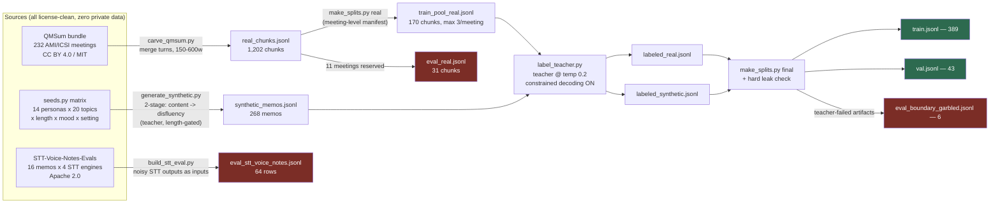
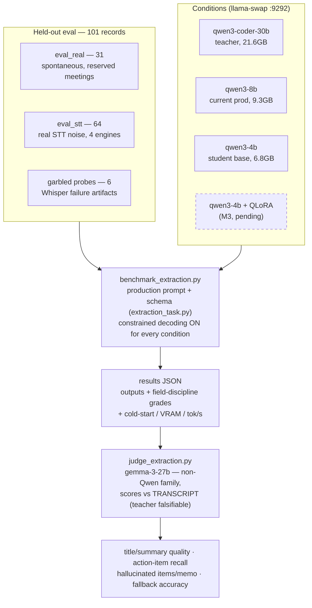
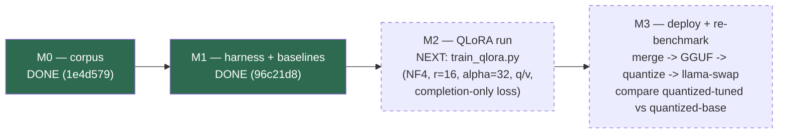

# LIMA extraction distillation — corpus & pipeline

Distills LIMA's structured-extraction task (voice memo transcript → 6-field
JSON note) from the production teacher model (`qwen3-coder-30b`) into a small
student, with an eval harness measuring retained content quality. The task
definition — system message, user template, JSON Schema — is imported verbatim
from the live n8n workflow via `extraction_task.py`, the single source of
truth for every pipeline stage.

## Pipeline map



Green = training surface. Red = held-out eval, never trained on.

## Corpus recipe (built 2026-07-04/05)

**Train 389 / val 43 pairs**, split by transcript/meeting (real) and by cell
id (synthetic), never by row. Assembled by `make_splits.py`; the manifest
(`corpus/split_manifest.json`) reserves whole AMI/ICSI meetings for eval and
`make_splits.py final` hard-fails if a labeled train row comes from one.

- **~60% synthetic** — two-stage teacher generation: fluent first-person memo
  from a persona × topic × length × mood × setting seed matrix (temp 0.9),
  then a disfluency-injection rewrite (temp 0.7) with a hard length gate.
  `seeds.py` + `generate_synthetic.py`.
- **~40% real spontaneous speech** — monologue-ish chunks carved from AMI and
  ICSI meeting transcripts (via the QMSum bundle): same-speaker turns merged
  across ≤1 short backchannel, 150–600 words, real disfluencies preserved,
  markup stripped. Parliamentary "Committee" transcripts excluded (prepared
  speech, wrong register). `carve_qmsum.py`.
- **Labels** — teacher runs the exact production task at temp 0.2 with
  llama.cpp schema-constrained decoding ON (the same condition every eval
  uses). `label_teacher.py`. Records carry `gen_version`/`label_version`;
  resume skips only rows produced by current code.

## Eval slices (`corpus/eval/` + `corpus/eval_real.jsonl`) — never trained on

- `eval_real.jsonl` — 31 chunks from 11 reserved AMI/ICSI meetings: genuinely
  spontaneous, disfluent held-out speech.
- `eval/eval_stt_voice_notes.jsonl` — 64 rows: 16 scripted voice-memo readings
  × 4 real STT systems' raw outputs (STT-Voice-Notes-Evals). The memos are
  scripted, not spontaneous — so the noisy STT outputs are the eval inputs and
  the clean scripts ride along as judge reference.
- `eval/eval_boundary_garbled.jsonl` — 6 STT-failure-artifact probes
  (verbatim loops, polite-phrase hallucinations, contentless prose). Routed
  here because the teacher itself fails them: it converts "Thanks for
  watching!" spam into a structured note instead of the fallback. Known
  teacher weakness, kept as an eval dimension.

## Measurement architecture (harness lives in `../scripts/`)



## Measured baselines (M1, 2026-07-05)

Full data: `../scripts/benchmark_results/extraction_judged_20260705_033305.json`.

| judge scores, 101 records | 30B teacher | 8B (prod) | 4B student |
|---|---|---|---|
| title / summary quality (1–5) | 4.77 / 4.76 | 4.75 / 4.79 | 4.82 / 4.84 |
| action-item recall | 0.99 | 0.96 | 0.98 |
| **hallucinated items / memo** | **0.41** | 0.83 | **1.59** |
| fallback accuracy (garbled slice) | ~1.0 | — | 0.33 |
| tags kebab-case (code grade) | 0.91 | 0.51 | 0.20 |
| VRAM loaded / cold start / median latency | 21.6GB / 5.5s / 1.1s | 9.3GB / 4.8s / 5.1s | 6.8GB / 2.7s / 1.8s |

The finding that defines M2: **surface quality is flat across model sizes;
the gap is grounding** (4x hallucination rate) **and format discipline**.
Also: the 30B MoE is the *fastest* per memo — the cost axis being right-sized
here is VRAM residency, not speed.

## Milestones



Prereqs already on disk for M2: `corpus/train.jsonl` + `val.jsonl`,
Qwen/Qwen3-4B-Instruct-2507 HF weights (hub cache), llama-swap routes for
`qwen3-4b` and the `gemma-3-27b` judge. Training-time chat template must be
verified against the GGUF's serving template before trusting any M3 number.

## Known limitations (read before citing numbers)

- **Self-distillation caveat**: the synthetic majority is generated AND
  labeled by the same teacher. Retention numbers on synthetic-style eval data
  are inflated by construction; the defensible claims come from the real/noisy
  held-out slices, judged by a different model family. Report them separately.
- **Domain skew in real chunks**: AMI is dominated by its remote-control
  design scenario; ICSI by speech-research meetings. Great disfluency
  coverage, weak personal-memo domain coverage.
- **Scripted STT eval**: the STT-Voice-Notes memos were written then read
  aloud — real STT noise, simulated spontaneity, single speaker/persona.

## Licensing & attribution

- Real chunks contain transcript excerpts from the **AMI Meeting Corpus** and
  the **ICSI Meeting Corpus** (CC BY 4.0,
  <https://groups.inf.ed.ac.uk/ami/>), modified (turn merging, markup
  removal, detokenization), obtained via the **QMSum** dataset (Yale-LILY,
  MIT, Zhong et al., NAACL 2021, <https://github.com/Yale-LILY/QMSum>).
- STT eval slice derives from **STT-Voice-Notes-Evals** by Daniel Rosehill
  (Apache 2.0 per HF metadata, DOI 10.57967/hf/6317,
  <https://huggingface.co/datasets/danielrosehill/STT-Voice-Notes-Evals>).
- Synthetic memos and all labels were generated locally by
  Qwen3-Coder-30B-A3B-Instruct (Q4_K_M) via llama.cpp. No private data
  anywhere in the corpus.

## Rebuild from scratch

```bash
git clone --depth 1 https://github.com/Yale-LILY/QMSum /tmp/QMSum
git clone https://huggingface.co/datasets/danielrosehill/STT-Voice-Notes-Evals /tmp/stt

python3 carve_qmsum.py --qmsum /tmp/QMSum
python3 make_splits.py real
python3 generate_synthetic.py --count 260          # needs llama-swap on :9292
python3 label_teacher.py --input corpus/synthetic_memos.jsonl --out corpus/labeled_synthetic.jsonl
python3 label_teacher.py --input corpus/train_pool_real.jsonl --out corpus/labeled_real.jsonl
python3 make_splits.py final
python3 build_stt_eval.py --src /tmp/stt
```
